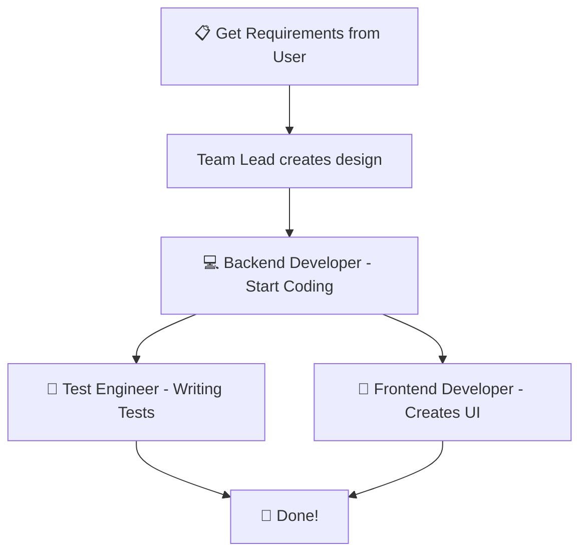

# EngineeringTeam Crew

In this project we created a whole team of engineers - Team Lead, Backend engineer, Frontend engineer and Test engineer.

```mermaid
graph TD;
  A[📋 Get Requirements from User] --> B[Team Lead creates design];
  B --> C[💻 Backend Developer - Start Coding];
  C --> D[🚀 Frontend Developer - Creates UI];
  C --> E[🧪 Test Engineer - Writing Tests];
  E --> F[🎉 Done!];
  D --> F;
  
```

 